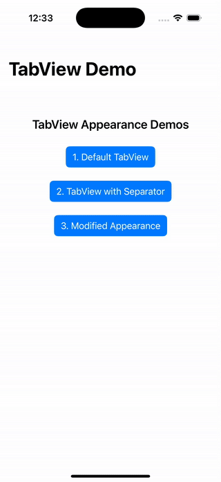
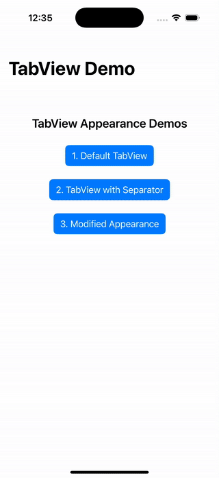

# SwiftUI TabView Appearance

This project demonstrates how to modify the system `TabView` in SwiftUI using `UITabBarAppearance`, without creating a custom tab bar. It showcases how to:

- Set a custom background color for the tab bar
- Modify selected and unselected item colors (text and icons)
- Ensure a consistent top separator line regardless of scroll content
- Use default `TabView` layout without replacing it

## ✨ Features Covered

- ✅ Default `TabView` with system styling
- 🎨 Modify tab bar background color
- 🔸 Change selected tab item appearance (orange)
- ⚪️ Change unselected tab item appearance (white)
- ➖ Always show separator line above the tab bar
- 📱 Built entirely with SwiftUI and UIKit's `UITabBarAppearance`

## 📸 Demo Previews

| Default TabView | TabView with Separator | Modified Appearance |
| - | - | - |
|  |  |  |
